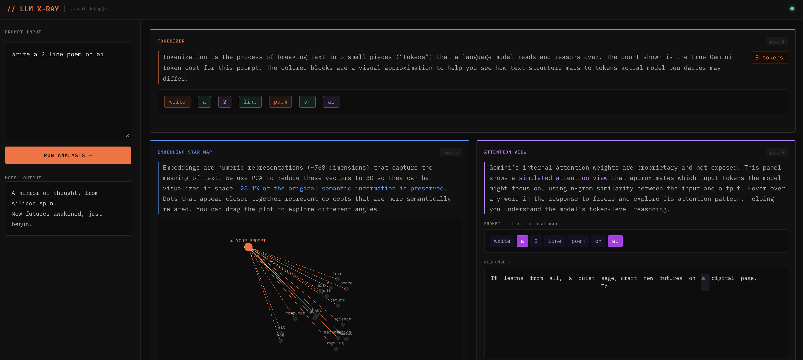
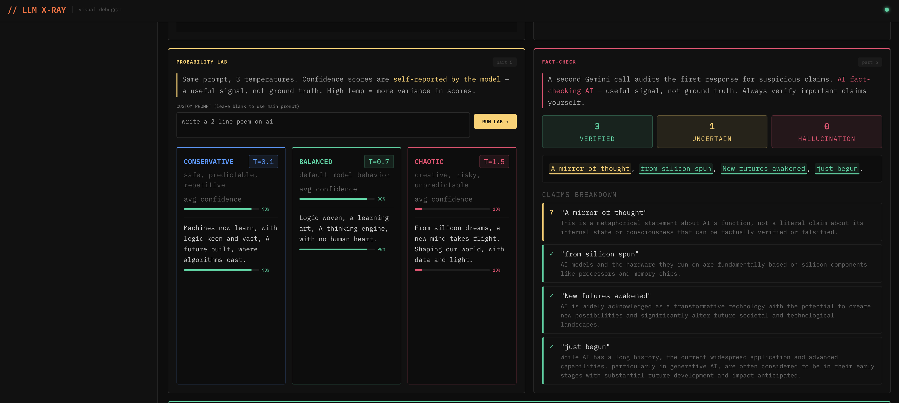
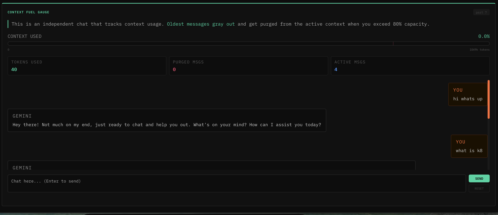

# LLM X-Ray

A visual debugger for large language models. Instead of treating AI as a black box, LLM X-Ray breaks down every concept that makes a language model work — tokenization, embeddings, attention, sampling, hallucinations, and context windows — and renders each one as an interactive panel in a live dashboard.

Built with React, FastAPI, and the Gemini API.

## Screenshots






---

## What It Does

Most developers and learners interact with LLMs through a simple text-in, text-out interface. LLM X-Ray replaces that with a seven-panel dashboard where every panel teaches a real concept by making it visible and interactive in real time.

---

## Panels

### Tokenizer
Submitting a prompt triggers a call to Gemini's token counting API, which returns the precise token count for your input. The dashboard renders each word and punctuation mark as a colored chip. The count shown is accurate; the visual boundaries between chips are an approximation, since Gemini does not expose exact tokenization boundaries. A disclaimer makes this clear. Hovering any chip shows its index.

### Embedding Star Map
Your prompt is encoded into a high-dimensional vector using `models/gemini-embedding-001`. Fifteen anchor concepts — words like "dog", "cat", "king", "science", "art", "war" — are embedded in the same space. PCA reduces all sixteen vectors to three dimensions, and the result is rendered as an interactive 3D scatter plot using Plotly. Your prompt appears as a highlighted point. Concepts that are semantically close to your prompt cluster nearby. The percentage of variance preserved by the PCA reduction is shown so you understand how much information was lost in the compression.

### Attention View
Gemini's real attention weights are proprietary and inaccessible. This panel simulates the concept using n-gram cosine similarity as a proxy. As the model streams its response word by word, each new word is scored against every token in the original prompt. Tokens that score highly light up in purple — the brighter the highlight, the stronger the simulated attention. Hovering any word in the response freezes the heat map on that word's pattern, letting you explore how different response words relate back to the prompt.

### Probability Lab
The same prompt is sent to three parallel Gemini calls with temperatures of 0.1, 0.7, and 1.5. Each call also asks the model to self-report a confidence score for every sentence it produces. The three responses are displayed in side-by-side columns — conservative, balanced, and chaotic — with a colored bar under each sentence showing the model's reported certainty. High temperature responses tend to produce more variance in both content and confidence scores.

### Fact-Check
After the main response is generated, a second hidden Gemini call audits it at temperature 0.1. This call is given a strict prompt instructing it to extract every factual claim and classify each one as verified, uncertain, or a likely hallucination. The results are rendered in two ways: inline highlights over the original response text (color-coded by verdict), and a breakdown list below showing the claim, its verdict, and the auditor's reasoning. Hovering a highlighted phrase shows the full explanation. The panel includes a disclaimer that this is AI auditing AI — a useful signal, not ground truth.

### Context Fuel Gauge
An independent chat interface that tracks how much of Gemini's context window your conversation has consumed. A gauge bar fills as you exchange messages. A marker at the 80% threshold indicates the danger zone. When usage crosses that threshold, the oldest messages in the conversation are visually grayed out and flagged as purged from the active context — illustrating what actually happens when a model runs out of context. Three stat chips show the exact token count, number of purged messages, and number of active messages in the current window.


## Setup

### Prerequisites

- Python 3.10 or later
- Node.js 18 or later
- A Gemini API key from [Google AI Studio](https://aistudio.google.com/app/apikey)

### Backend

```bash
cd backend
python -m venv venv
source venv/bin/activate       # Windows: venv\Scripts\activate
pip install -r requirements.txt
```

Create a `.env` file in the `backend/` directory:

```
GEMINI_API_KEY=your_key_here
```

Start the server:

```bash
uvicorn main:app --reload
```

The API will be available at `http://localhost:8000`.

### Frontend

```bash
cd frontend
npm install
npm run dev
```

The app will be available at `http://localhost:5173`. Vite proxies all `/api` requests to the FastAPI backend automatically.

---

## API Endpoints

| Method | Path | Description |
|---|---|---|
| POST | `/api/generate` | Generate a response from Gemini |
| POST | `/api/tokenize` | Count tokens and return approximate visual splits |
| POST | `/api/embeddings` | Embed the prompt and anchor concepts, return PCA-reduced 3D coordinates |
| POST | `/api/attention-stream` | Stream a response with per-word n-gram attention scores (SSE) |
| POST | `/api/temperature-lab` | Run three parallel generations at different temperatures |
| POST | `/api/factcheck` | Audit a response for hallucinated or uncertain claims |
| POST | `/api/chat` | Multi-turn chat with token tracking for the context gauge |

---
