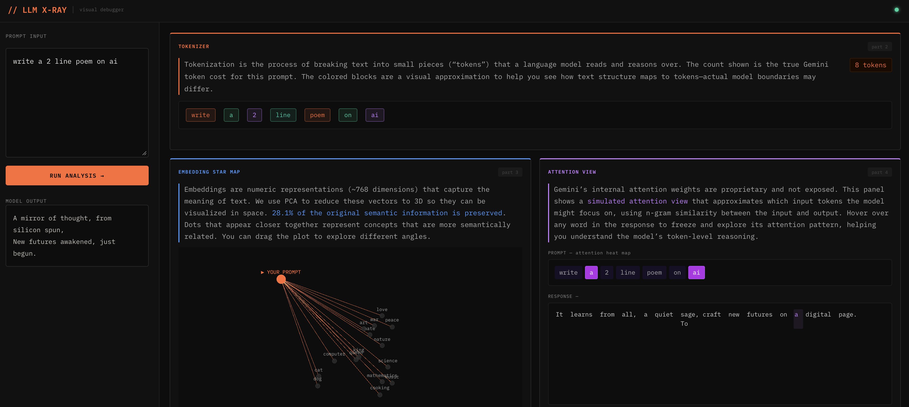
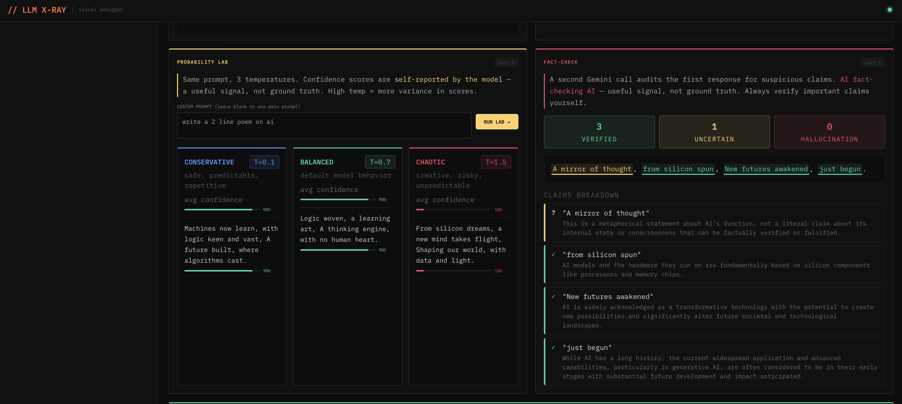
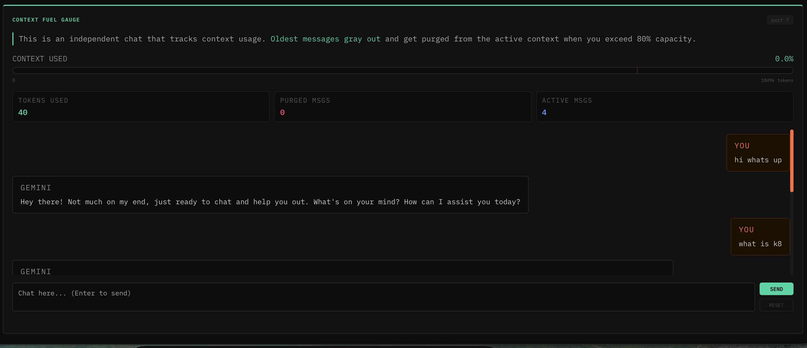

# LLM X-Ray

A visual debugger for large language models. Instead of treating an LLM as a black box, LLM X-Ray breaks down every concept that makes one work — tokenization, embeddings, attention, sampling, hallucinations, throughput, cost, and the context window — and renders each as a live panel in a seven-panel dashboard.

Every panel is fed by its own server-sent-event stream, so results fill in as they are produced rather than appearing all at once when a request finishes.

Built with React, FastAPI, and the Gemini API. Containerized and deployed on AWS ECS Fargate.

## Screenshots







---

## Architecture

```
React 19 + Vite                    FastAPI (Python 3.12)
┌─────────────────────┐            ┌──────────────────────────────┐
│  7 panels           │  SSE       │  7 streaming endpoints       │
│  useSSE / streamSSE │ ─────────► │  /api/stream/*               │
└─────────────────────┘            └───────────┬──────────────────┘
                                               │
                        ┌──────────────────────┼─────────────────┐
                        ▼                      ▼                 ▼
                  Gemini API            numpy SVD / PCA       Amazon SNS
                  (generate,            (768-d → 3-d)         (threshold
                   embed, count)                               alerts)
```

A single container serves both halves: the Vite build is compiled into static assets and mounted under the FastAPI app, so there is one origin, one port, and no CORS in production.

---

## Panels and endpoints

Each panel maps to exactly one SSE endpoint.

| # | Panel | Endpoint | What streams |
|---|---|---|---|
| 1 | Tokenizer | `POST /api/stream/tokenize` | exact token count, then each token chip in order |
| 2 | Generation Stream | `POST /api/stream/generate` | response chunks, with live tokens/sec and cost |
| 3 | Embedding Star Map | `POST /api/stream/embeddings` | per-vector embedding progress, then the 3D PCA projection |
| 4 | Attention View | `POST /api/stream/attention` | each generated word with its simulated attention over the prompt |
| 5 | Probability Lab | `POST /api/stream/temperature` | three concurrent calls, each column rendering as its call returns |
| 6 | Fact-Check | `POST /api/stream/factcheck` | each audited claim as it is extracted |
| 7 | Context Fuel Gauge | `POST /api/stream/chat` | reply chunks, context usage, SNS alert result, purge instruction |

Two supporting routes: `GET /healthz` (ECS health check) and `GET /api/config` (limits and pricing the dashboard renders).

### Wire format

Every endpoint speaks the same protocol — newline-delimited `data:` frames, each a JSON object with a `type` discriminator, terminated by a literal `data: [DONE]`:

```
data: {"type": "token", "text": "Paris ", "metrics": {...}}
data: {"type": "metrics", "output_tokens": 42, "tokens_per_second": 31.5, "cost_usd": 0.000112}
data: [DONE]
```

`EventSource` only issues GET requests and every panel posts a JSON body, so the client reads the `fetch` response body directly ([`src/lib/sse.js`](frontend/src/lib/sse.js)) instead.

---

## What each panel does

### 1. Tokenizer
Calls Gemini's token-counting API for the exact token cost of the prompt, then streams each piece in as a colored chip. The **count is accurate**; the chip boundaries are an approximation, because Gemini does not expose its true tokenization boundaries. The panel says so.

### 2. Generation Stream
The raw response, streamed chunk by chunk. Throughput and cost update as it arrives. Interim frames estimate output tokens from word count; the final frame replaces that estimate with Gemini's own reported `usage_metadata`, so the number you end up looking at is authoritative rather than inferred.

### 3. Embedding Star Map
Embeds the prompt and fifteen fixed anchor concepts, then reduces all sixteen vectors to three dimensions with PCA and plots them. The panel reports how much variance the projection preserved, so you can tell when the 3D view is misleading. Anchor embeddings are computed once and cached — re-embedding fifteen constants on every prompt is fifteen wasted API calls.

The PCA runs on numpy's SVD directly. At this shape (16x768, 3 components) scikit-learn's default solver is its *randomized* approximation, so dropping the dependency made the projection exact and cut ~270MB from the container image.

### 4. Attention View
Gemini does not expose real attention weights. This panel builds a **simulated** attention map from character n-gram similarity between each output word and each prompt token, normalized to sum to 1. Hover any word to freeze its pattern. It is a teaching aid for what attention does, not a readout of the model's internals, and the UI states that plainly.

### 5. Probability Lab
The same prompt at three temperatures (0.1, 0.7, 1.5), fired as three concurrent inference calls. Columns render in completion order rather than waiting for the slowest. Each sentence carries a confidence score **self-reported by the model** — a useful signal, not ground truth.

### 6. Fact-Check
A second, low-temperature Gemini call audits the first response and extracts claims as verified / uncertain / hallucination. Claims stream back one at a time and are highlighted inline in the original text. AI fact-checking AI is a signal, not proof.

### 7. Context Fuel Gauge
An independent chat that meters its own context consumption: tokens used against the model's window, tokens/sec, and cost per request. Crossing 80% of the window publishes an **Amazon SNS notification** and drops the oldest messages from the active context — the purge every production chat app eventually has to implement, made visible.

The alert result is reported honestly: if SNS is unconfigured or the publish fails, the panel says the alert was **not** sent and why, rather than showing a success it did not get.

---

## Running locally

Requires Python 3.12+, Node 20+, and a [Gemini API key](https://aistudio.google.com/apikey).

```bash
# backend
cd backend
python3 -m venv venv && source venv/bin/activate
pip install -r requirements.txt
echo "GEMINI_API_KEY=your-key-here" > .env
uvicorn main:app --reload --port 8000

# frontend (second terminal)
cd frontend
npm install
npm run dev          # http://localhost:5173, proxies /api to :8000
```

SNS alerts stay disabled locally unless `SNS_TOPIC_ARN` is set; the gauge still purges and says why no alert went out.

### Tests

```bash
cd backend
pip install -r requirements-dev.txt
pytest -q
```

Thirty-five tests cover the SSE contract of all seven endpoints against a mocked Gemini SDK — no API key, no network, no quota — plus the parsing and metering helpers. They assert the things that are easy to get quietly wrong: token chips reassembling into the original prompt, attention scores summing to 1, the meter preferring reported usage over its own estimate, a chunk carrying no text not truncating the stream, and a failed SNS publish never being reported as sent.

---

## Configuration

All settings are environment variables ([`backend/config.py`](backend/config.py)).

| Variable | Default | Purpose |
|---|---|---|
| `GEMINI_API_KEY` | — | required |
| `CHAT_MODEL` | `gemini-2.5-flash` | generation model |
| `EMBEDDING_MODEL` | `models/gemini-embedding-001` | embedding model |
| `CONTEXT_LIMIT` | `1048576` | context window used by the gauge |
| `PURGE_THRESHOLD` | `0.80` | fraction that triggers alert + purge |
| `PURGE_BATCH_SIZE` | `2` | messages dropped per purge |
| `INPUT_COST_PER_1M` | `0.30` | USD per 1M input tokens |
| `OUTPUT_COST_PER_1M` | `2.50` | USD per 1M output tokens |
| `SNS_TOPIC_ARN` | — | set to enable alerts |
| `ALLOWED_ORIGINS` | `http://localhost:5173` | CORS origins for dev |
| `STATIC_DIR` | `static` | built frontend, set in the image |

Pricing is configurable rather than hardcoded because list prices move, and a stale constant silently makes every cost readout wrong.

---

## Deploying to AWS ECS

```bash
GEMINI_API_KEY=your-key ALERT_EMAIL=you@example.com ./infra/provision.sh
./infra/deploy.sh
```

`provision.sh` is idempotent and creates the ECR repository (with a 5-image lifecycle policy), the SNS topic and email subscription, the CloudWatch log group, the two IAM roles, the SSM SecureString holding the Gemini key, the ECS cluster, and a security group.

`deploy.sh` builds for `linux/amd64` — an Apple Silicon host would otherwise push an arm64 image Fargate cannot start — pushes to ECR, registers the task definition, creates or updates the Fargate service, waits for it to stabilize, and prints the public URL.

Two roles, not one: the **execution role** reads the Gemini key from SSM before the container starts; the **task role** is what the running app holds, and it is scoped to `sns:Publish` on one topic. The API key is never baked into the image or the task definition.

```bash
./infra/teardown.sh          # delete the service — stops all Fargate charges
./infra/teardown.sh --all    # also remove cluster, ECR, SNS, roles, logs
```

A single 0.5 vCPU / 1 GB Fargate task plus its public IPv4 address runs about **$21/month** if left up. `teardown.sh` exists because a portfolio project should not quietly bill you.

---

## Notes on honesty

Three panels show approximations, and each says so in the UI rather than in the README only:

- **Token chips** are visual boundaries, not Gemini's real ones. The count is real.
- **Attention** is simulated from n-gram similarity. Gemini's weights are not public.
- **Confidence scores** are the model's own claims about itself, not calibrated probabilities.

An observability tool that misrepresents its own precision is worse than no tool, so the approximations are labeled where someone will actually read them.
